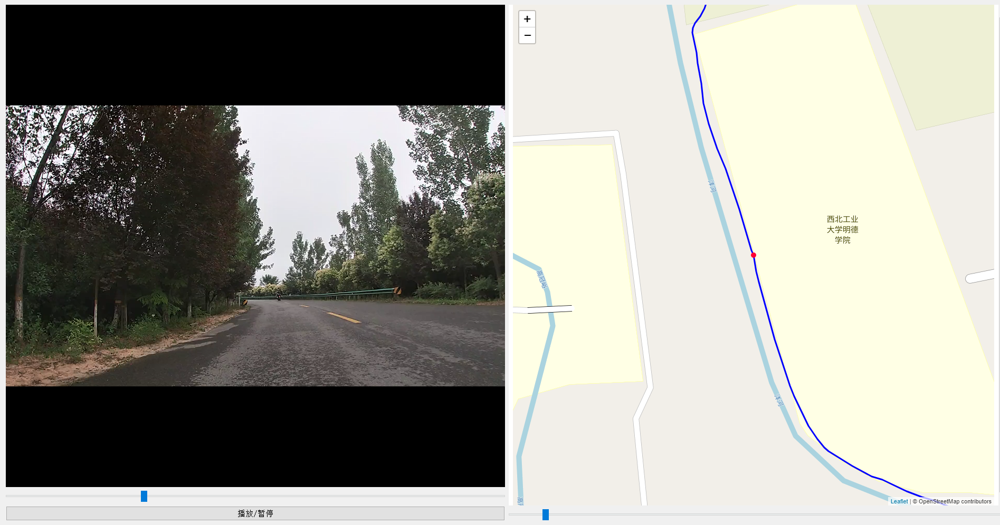

# 基于Python 实现 VIRB功能

在视频播放过程中，地图上的红点将根据GPS数据实时移动，直观地显示位置变化。用户在调整地图上的红点位置时，视频播放不会自动同步跟随，允许独立查看和精确调整特定时刻的地理位置。

该特性尤其有助于确保视频内容与GPS记录的对齐，例如，用户可手动对齐特定视频时间点（如视频中的45秒）与GPS时间点（如78秒处的GPS数据），从而实现视频播放和位置追踪的精准匹配。

在模板-地图界面调整svg的位置和大小，并进行预览

相关文档见[Note](https://github.com/lzhqw/OpenVIRB/blob/main/Note.md)
